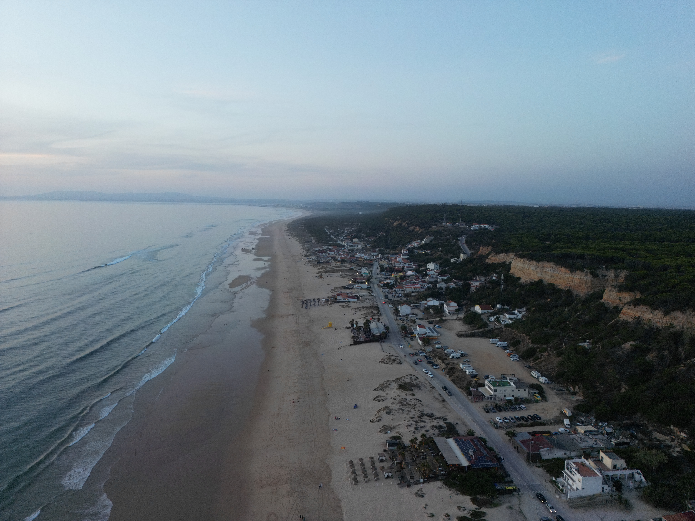

# 🖼️ Image Optimization Guide for Imagem Elevada

## Current Image Inventory

Your website contains approximately 30+ images across multiple folders:
- **Main folder (images/)**: Logo files, drone photos, portfolio images
- **acores/** (6 images): Açores portfolio
- **CasaConstrucao/** (7 images): Construction project photos  
- **fonteTelha/** (6 images): Fonte Telha project
- **sorteVerde/** (2 images): Sorte Verde project
- **casaMarisol/**: Empty folder

## Optimization Strategy

### Step 1: Format Conversion
Convert high-quality originals to WebP format (40-60% smaller than JPEG):
- Logo files → Keep PNG + create WebP versions
- Drone photos (JPG) → Compress + create WebP versions
- High-res images → Create multiple sizes for responsive design

### Step 2: Best Tools to Use

#### Option A: Squoosh (Recommended - Easiest)
**Free, no registration required**
1. Go to https://squoosh.app
2. Upload your JPEG/PNG images
3. Convert to WebP format
4. Adjust quality (75-80% recommended for photos)
5. Download optimized files
6. Sort by folder and re-upload to replace originals

**Benefits:**
- Batch processing
- See before/after file sizes
- WebP conversion with fallback options
- Works in browser

#### Option B: TinyPNG/TinyJPG
**Excellent for lossy compression**
- Visit https://tinypng.com
- Upload up to 20 files at once
- Processes automatically
- Download optimized batch

#### Option C: Compressor.io
**Good for multiple formats**
- https://compressor.io
- Batch upload support
- WebP conversion available

### Step 3: File Size Targets

| Type | Current → Target | Tool |
|------|-----------------|------|
| Logo (PNG) | Keep small | Squoosh + lossy |
| Drone photos (JPG) | 3-5MB → 500KB-1MB | Squoosh WebP 75% |
| Portfolio images | 2-4MB → 300-600KB | Squoosh WebP 75% |
| Thumbnails | 1-2MB → 100-200KB | Squoosh WebP 70% |

### Step 4: Update HTML

After optimizing, update your HTML to serve WebP with fallback:

```html
<!-- Modern way with picture element -->
<picture>
  <source srcset="images/DJI_0380.webp" type="image/webp">
  
</picture>

<!-- Or using srcset for responsive images -->
<picture>
  <source media="(max-width: 768px)" srcset="images/DJI_0380-sm.webp" type="image/webp">
  <source media="(max-width: 768px)" srcset="images/DJI_0380-sm.jpg">
  <source srcset="images/DJI_0380.webp" type="image/webp">
  
</picture>
```

### Step 5: Expected Results

**Space Savings:**
- Portfolio JPGs: 40-50% reduction
- PNG logos: 20-30% reduction  
- Average site reduction: 50-70MB → 15-20MB

**Performance Impact:**
- Faster page loads (critical for drone portfolio)
- Better SEO rankings
- Mobile users see faster images

## Workflow

### Quick Process:
1. Create backup of original images
2. Use Squoosh to batch convert to WebP
3. Keep original JPG/PNG as fallback (smaller compressed version)
4. Update HTML to use picture elements
5. Test on main.html and portfolio pages
6. Upload to server

### No Installation Needed:
- All recommended tools are web-based
- No software to install
- Works immediately

## Recommended Quality Settings

- **Drone photos**: WebP quality 75-80%
- **Portfolio shots**: WebP quality 75%
- **Logos/Icons**: PNG (lossless)
- **Thumbnails**: WebP quality 70%

## Questions?

If you need help updating the HTML files after optimization, let me know and I can automate that process for you using the generated WebP filenames.

---

**Timeline:** 30-45 minutes with web-based tools (mostly waiting for uploads/downloads)
**No coding required** - Just drag and drop!
